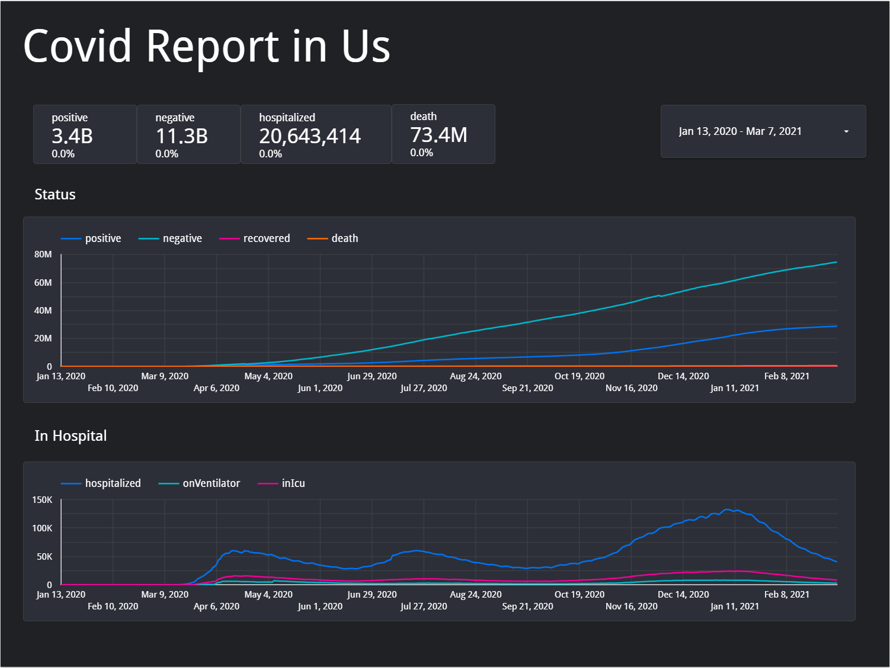
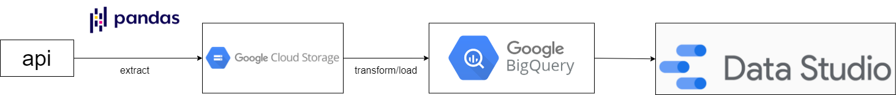

# Data Engineering: COVID19 Dashboard

	A link data
	<a href="https://datastudio.google.com/u/1/reporting/08d2d1f3-62f0-409a-baf3-f4f337b3e54f/page/4cETC">dashboard</a>
	pulling data from an automated data pipeline.

## About The Project
This project is about create  and end to end pipeline collecting covid data in united states Portfolio for job application.

## Setup
<a href="https://cloud.google.com/composer/?utm_source=google&utm_medium=cpc&utm_campaign=japac-TH-all-en-dr-bkws-all-all-trial-e-dr-1009882&utm_content=text-ad-none-none-DEV_c-CRE_308495415737-ADGP_Hybrid%20%7C%20BKWS%20-%20EXA%20%7C%20Txt%20~%20Data%20Analytics%20~%20Cloud%20Composer_Cloud%20Composer-KWID_43700037061628273-kwd-525879649670&userloc_1012728-network_g&utm_term=KW_google%20cloud%20platform%20composer&gclid=CjwKCAjwoZWHBhBgEiwAiMN66U9vTYv136BsAaO7Kqg-Hu-kepeNNbQFhXPgcuIk2Yi067lCyvP-hxoCfk4QAvD_BwE&gclsrc=aw.ds">cloud composer</a> 
<a href="https://cloud.google.com/storage/?utm_source=google&utm_medium=cpc&utm_campaign=japac-TH-all-en-dr-skws-all-pkws-trial-e-dr-1009882&utm_content=text-ad-none-none-DEV_c-CRE_497145687063-ADGP_Hybrid%20%7C%20SKWS%20-%20EXA%20%7C%20Txt%20~%20Storage%20~%20Cloud%20Storage_Global%20gap%20analysis-KWID_43700060660240636-kwd-7346428414&userloc_1012728-network_g&utm_term=KW_cloud%20storage&gclid=CjwKCAjwoZWHBhBgEiwAiMN66eedVhljIVGR7CVC9H9t4fPJWD0KsHoGfFBzIkJ_Na52fg35dUjDiRoCFm8QAvD_BwE&gclsrc=aw.ds">cloud storage</a> 
<a href="https://cloud.google.com/bigquery/?utm_source=google&utm_medium=cpc&utm_campaign=japac-TH-all-en-dr-bkws-all-super-trial-e-dr-1009882&utm_content=text-ad-none-none-DEV_c-CRE_316270751276-ADGP_Hybrid%20%7C%20BKWS%20-%20EXA%20%7C%20Txt%20~%20Data%20Analytics%20~%20BigQuery_bigquery-KWID_43700028131581238-kwd-297617549231&userloc_1012728-network_g&utm_term=KW_bigquery&gclid=CjwKCAjwoZWHBhBgEiwAiMN66dIADyIy6-APx9-N72LIRASpA5CE9IuzgAtagR9WttkqTL5rpSC1_BoC084QAvD_BwE&gclsrc=aw.ds">big query</a> 
<a href="https://datastudio.google.com/u/0/">dashboard</a> 

## Design workflow

## How-to-do

1. Get data API from <a href="https://datastudio.google.com/u/1/reporting/08d2d1f3-62f0-409a-baf3-f4f337b3e54f/page/4cETC">covidtracking</a> by requests library ingest  and cleaned data with pandas then using python store in google storage.
	
2. transform the data into schema.
	
3. send mail once all task in airflow success.

4. Create dashboard visualization using google data studio.

## Library
requests 
pandas

